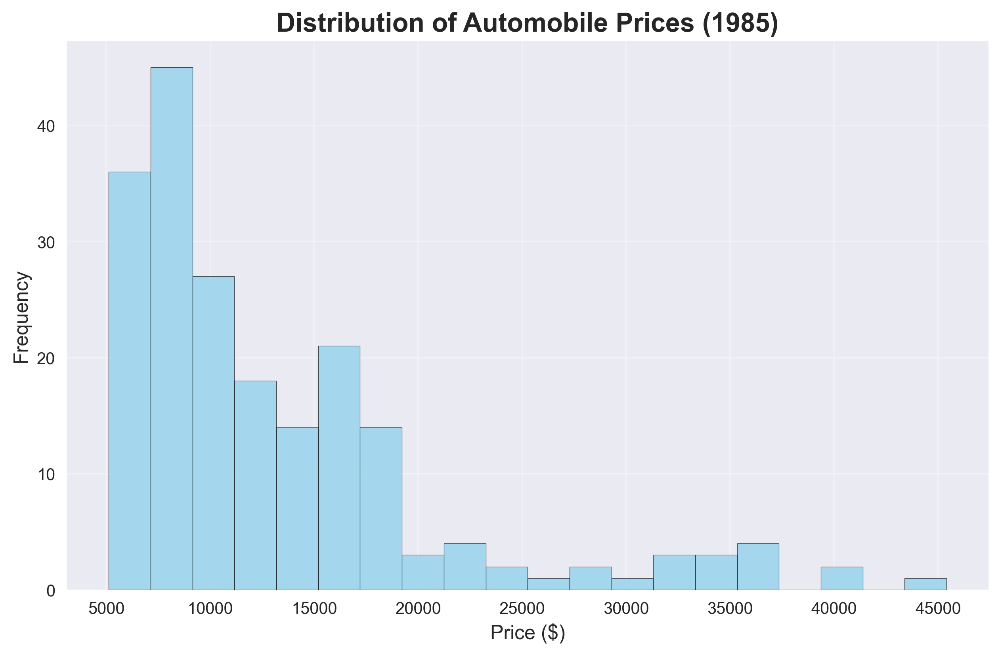
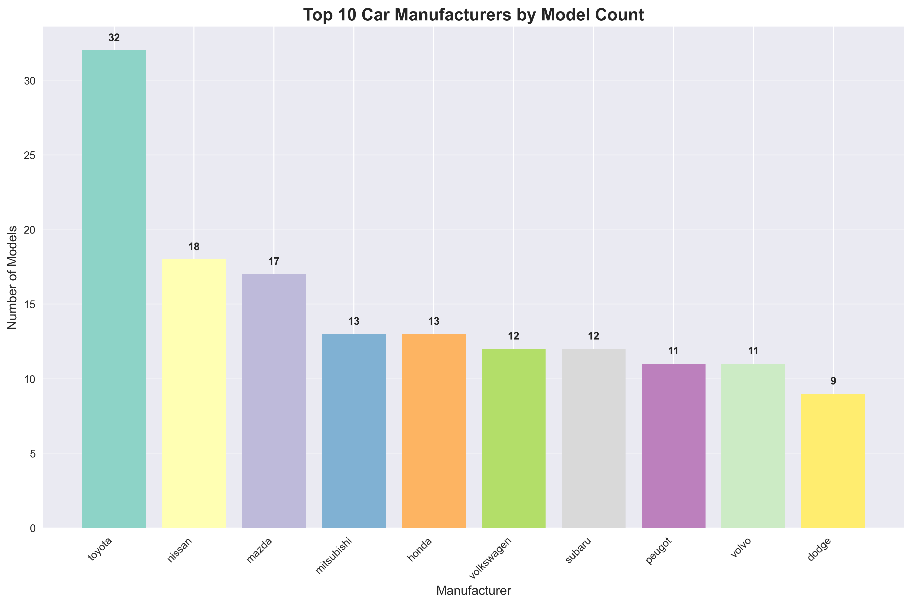
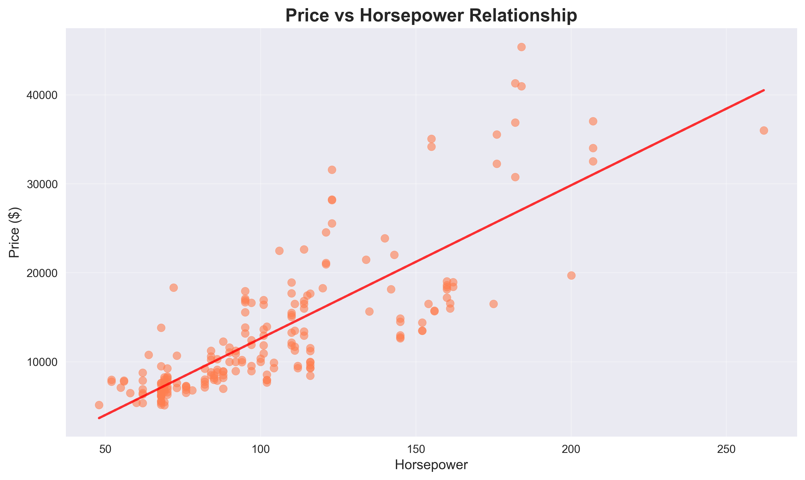
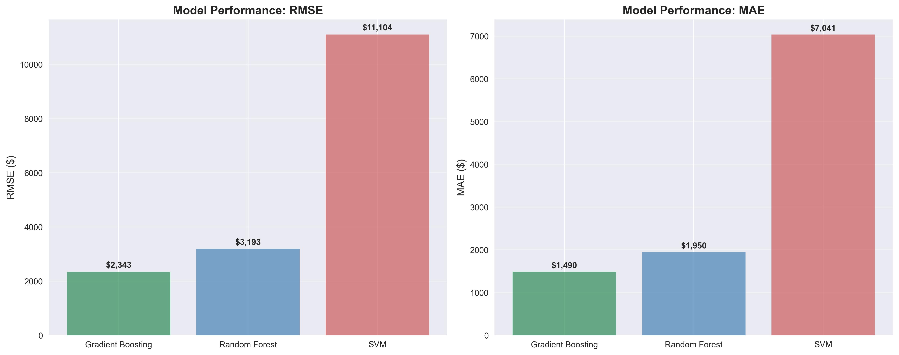
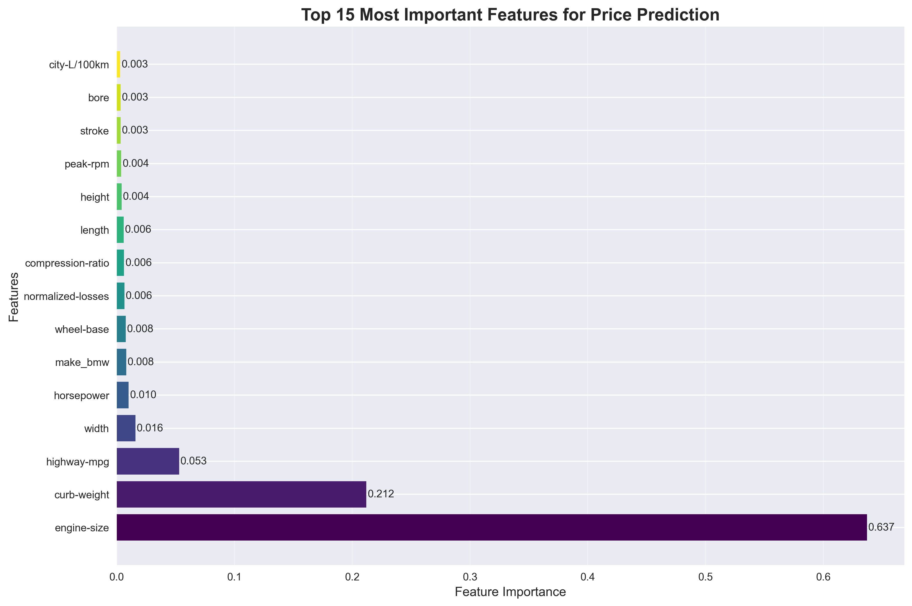
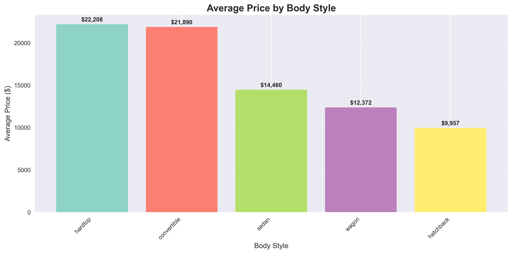

# Predicting Automobile Prices: A Machine Learning Journey Through 1985 Car Data

*By Shubh Gupta*

## Introduction

In the world of data science and machine learning, predicting automobile prices has always been a fascinating challenge. This project explores the 1985 Automobile Dataset, a classic dataset that contains detailed information about various car models from the mid-1980s. Our goal was to build machine learning models that could accurately predict car prices based on their technical specifications and features.

## The Dataset: A Glimpse into 1985 Automotive Market

The dataset contains **201 automobile records** with **29 features** covering various aspects of vehicle design and performance. Here's what we're working with:

### Key Statistics
- **Price Range**: $5,118 - $45,400
- **Average Price**: $13,207
- **Total Features**: 29 (18 numerical, 10 categorical)
- **Top Manufacturers**: Toyota (32 models), Nissan (18), Mazda (17), Mitsubishi (13), Honda (13)

*Figure 1: Distribution of automobile prices in the 1985 dataset. Most cars fall in the $5,000-$20,000 range, with a few luxury vehicles reaching $40,000+.*

*Figure 2: Top 10 car manufacturers by number of models in the dataset. Toyota dominates with 32 different models.*

### Feature Categories

**Numerical Features (18):**
- Physical dimensions: wheel-base, length, width, height, curb-weight
- Engine specifications: engine-size, bore, stroke, compression-ratio, horsepower, peak-rpm
- Performance metrics: city-mpg, highway-mpg, city-L/100km
- Safety: normalized-losses, symboling
- Fuel type indicators: diesel, gas

**Categorical Features (10):**
- Make and model information
- Body style (sedan, hatchback, wagon, convertible, hardtop)
- Engine configuration (aspiration, engine-type, num-of-cylinders, fuel-system)
- Drive train (drive-wheels, engine-location, num-of-doors)

## Data Preprocessing: The Foundation of Success

Before training our models, we implemented a comprehensive preprocessing pipeline:

### 1. Data Cleaning
- Handled missing values using appropriate imputation strategies
- Normalized numerical features to ensure fair comparison
- Encoded categorical variables for machine learning compatibility

### 2. Feature Engineering
- Created derived features like `city-L/100km` for fuel efficiency
- Binned horsepower into categories (Low, Medium, High)
- Added fuel type indicators (diesel vs gas)

### 3. Preprocessing Pipeline
The preprocessing involved two main steps:
- **Numerical features**: Mean imputation + standardization
- **Categorical features**: Mode imputation + one-hot encoding

*Figure 3: Relationship between horsepower and price. There's a clear positive correlation, with higher horsepower generally corresponding to higher prices.*

## Machine Learning Models: Three Approaches

We implemented and compared three different machine learning algorithms:

### 1. Gradient Boosting Regressor
- **RMSE**: $2,342.99
- **MAE**: $1,490.09
- **Performance**: Best overall performance
- **Advantages**: Handles non-linear relationships well, robust to outliers

### 2. Random Forest Regressor
- **RMSE**: $3,193.12
- **MAE**: $1,950.25
- **Performance**: Second best performance
- **Advantages**: Provides feature importance, handles mixed data types

### 3. Support Vector Machine (SVM)
- **RMSE**: $11,104.09
- **MAE**: $7,041.45
- **Performance**: Least effective for this dataset
- **Limitations**: Linear kernel may be too restrictive for complex price relationships

## Results Analysis: What We Learned

### Model Performance Comparison

*Figure 4: Model performance comparison using RMSE and MAE metrics. Gradient Boosting clearly outperforms other models.*

| Model | RMSE | MAE | Performance Rank |
|-------|------|-----|------------------|
| Gradient Boosting | $2,343 | $1,490 | 1st |
| Random Forest | $3,193 | $1,950 | 2nd |
| SVM (Linear) | $11,104 | $7,041 | 3rd |

### Key Insights

1. **Ensemble Methods Excel**: Both Gradient Boosting and Random Forest significantly outperformed the linear SVM, suggesting that automobile prices have complex, non-linear relationships with features.

2. **Feature Importance**: The Random Forest model revealed that engine specifications (horsepower, engine-size) and physical dimensions (curb-weight, length) are among the most important predictors of price.

*Figure 5: Top 15 most important features for price prediction. Engine specifications and physical dimensions dominate the feature importance rankings.*

3. **Data Quality Matters**: The preprocessing steps, especially handling missing values and feature scaling, were crucial for model performance.

4. **Domain Knowledge Integration**: Features like fuel efficiency (city-L/100km) and horsepower binning helped capture domain-specific relationships.

## Technical Implementation Details

### Data Split Strategy
- **Training Set**: 80% of data (160 samples)
- **Test Set**: 20% of data (41 samples)
- **Random State**: 42 (for reproducibility)

### Evaluation Metrics
- **Root Mean Square Error (RMSE)**: Measures prediction accuracy in the same units as price
- **Mean Absolute Error (MAE)**: Provides a robust measure of prediction error

### Cross-Validation
The models were trained using a train-test split approach, with the preprocessing pipeline applied consistently to both training and test sets.

## Business Implications

### For Car Manufacturers
- Understanding which features most influence price can guide design decisions
- Engine specifications and physical dimensions are key price drivers
- Fuel efficiency features significantly impact pricing

*Figure 6: Average price by body style. Convertibles and hardtops command the highest prices, while hatchbacks are typically more affordable.*

### For Consumers
- Price prediction models can help in car purchasing decisions
- Understanding feature-price relationships aids in value assessment
- Models can identify overpriced or underpriced vehicles

### For Insurance and Finance
- Accurate price predictions support insurance valuation
- Lending decisions can be informed by predicted vehicle values
- Risk assessment benefits from reliable price estimates

## Challenges and Limitations

### Dataset Limitations
- **Historical Data**: 1985 data may not reflect current market dynamics
- **Limited Sample Size**: 201 samples is relatively small for complex ML models
- **Feature Availability**: Some modern features (safety ratings, technology) are missing

### Model Limitations
- **Linear SVM Performance**: The linear kernel was too restrictive for this complex problem
- **Feature Engineering**: More sophisticated feature engineering could improve performance
- **Hyperparameter Tuning**: Models could benefit from more extensive parameter optimization

## Future Improvements

### Model Enhancements
1. **Hyperparameter Optimization**: Implement grid search or Bayesian optimization
2. **Feature Selection**: Use techniques like LASSO or recursive feature elimination
3. **Ensemble Methods**: Combine multiple models for better predictions
4. **Deep Learning**: Explore neural networks for complex pattern recognition

### Data Enhancements
1. **Larger Dataset**: Collect more recent and comprehensive data
2. **Additional Features**: Include safety ratings, technology features, brand reputation
3. **Market Data**: Incorporate supply-demand dynamics and market trends

## Conclusion

This project successfully demonstrates the application of machine learning to automobile price prediction. The Gradient Boosting model achieved the best performance with an RMSE of $2,343, providing reasonably accurate price predictions for the 1985 automobile market.

The project highlights several important lessons:
- **Ensemble methods** are particularly effective for complex regression problems
- **Proper preprocessing** is crucial for model performance
- **Domain knowledge** integration through feature engineering improves results
- **Multiple evaluation metrics** provide comprehensive performance assessment

While the models perform well on this historical dataset, real-world applications would benefit from more recent data and additional features that reflect current automotive market dynamics.

---

*This project was completed as part of CS677 Data Science course at Boston University, demonstrating practical application of machine learning techniques to real-world problems.*

**Keywords**: Machine Learning, Regression, Automobile Pricing, Gradient Boosting, Random Forest, Data Science, Feature Engineering, Predictive Modeling 